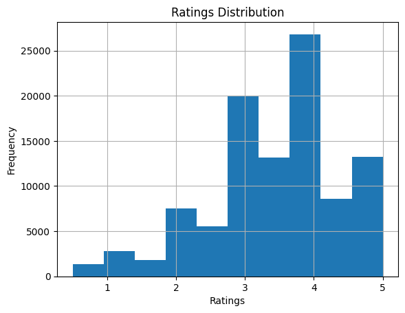
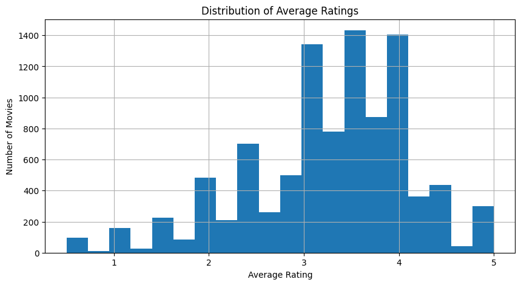
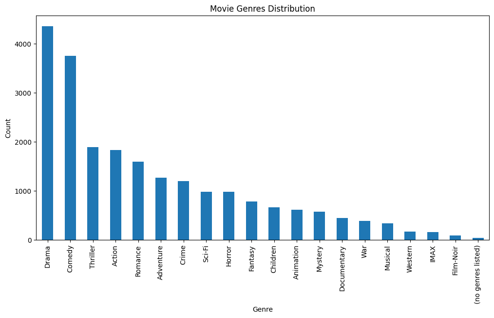

# 🎬 Movie Recommendation System

A Machine Learning-based Movie Recommendation System that suggests movies using **Content-Based Filtering** and **Collaborative Filtering** techniques. The project analyzes movie genres and user ratings from the MovieLens dataset to generate personalized movie recommendations.

---

## 📌 Project Overview

Recommendation systems are widely used by platforms like Netflix, Amazon Prime, and Spotify to personalize user experiences.

This project demonstrates two popular recommendation approaches:

- **Content-Based Filtering** – Recommends movies with similar genres using TF-IDF vectorization and Cosine Similarity.
- **Collaborative Filtering** – Recommends movies based on user rating behavior using a user-movie interaction matrix and Cosine Similarity.

---

## 🚀 Features

- 📊 Exploratory Data Analysis (EDA)
- 🧹 Data Cleaning and Preprocessing
- 🎭 Genre-Based Movie Recommendations
- ⭐ User Rating-Based Recommendations
- 📈 Data Visualizations
- 🎯 Interactive Recommendation Functions
- 📚 Comparison of Content-Based and Collaborative Filtering

---

## 🛠️ Technologies Used

- Python
- Pandas
- NumPy
- Matplotlib
- Seaborn
- Scikit-learn
- Google Colab

---

## 📂 Dataset

This project uses the **MovieLens Latest Small Dataset**.

Dataset includes:

- `movies.csv`
- `ratings.csv`

The dataset contains:

- Movie titles
- Genres
- User ratings
- Movie IDs
- User IDs

---

## 📊 Exploratory Data Analysis

The project performs:

- Missing value analysis
- Dataset exploration
- Ratings distribution
- Genre distribution
- Most rated movies
- Average movie ratings

---

## 🧠 Recommendation Techniques

### 1️⃣ Content-Based Filtering

Content-Based Filtering recommends movies based on similarities in movie genres.

### Workflow

- Extract movie genres
- Convert genres into TF-IDF vectors
- Compute Cosine Similarity
- Recommend the most similar movies

---

### 2️⃣ Collaborative Filtering

Collaborative Filtering recommends movies based on user rating patterns.

### Workflow

- Create a User-Movie Rating Matrix
- Replace missing ratings with zeros
- Compute Movie-to-Movie Cosine Similarity
- Recommend movies liked by users with similar preferences

---

## 📷 Sample Outputs

### Genre Distribution


---

### Ratings Distribution



---

### Content-Based Recommendation



---

### Collaborative Filtering Recommendation



---

## 📁 Project Structure

```
Movie-Recommendation-System/
│
├── Movie_Recommendation_System.ipynb
├── README.md
├── requirements.txt
├── LICENSE
│
├── dataset/
│   ├── movies.csv
│   └── ratings.csv
│
└── images/
    ├── genre_distribution.png
    ├── ratings_distribution.png
    ├── content_recommendation.png
    └── collaborative_recommendation.png
```

---

## ⚙️ Installation

Clone the repository

```bash
git clone https://github.com/your-username/Movie-Recommendation-System.git
```

Navigate into the project

```bash
cd Movie-Recommendation-System
```

Install dependencies

```bash
pip install -r requirements.txt
```

Run the notebook using Jupyter Notebook or Google Colab.

---

## 📈 Future Improvements

- Hybrid Recommendation System
- Matrix Factorization (SVD)
- Deep Learning-based Recommendation Models
- Streamlit Web Application
- Personalized User Profiles
- Recommendation Evaluation Metrics

---

## 🎯 Learning Outcomes

Through this project, I learned:

- Data preprocessing techniques
- Exploratory Data Analysis (EDA)
- TF-IDF Vectorization
- Cosine Similarity
- Content-Based Recommendation Systems
- Collaborative Filtering
- Data Visualization using Matplotlib and Seaborn

---

## 📜 License

This project is licensed under the MIT License.

---

## 👩‍💻 Author

**Vaishnavi Waghmare**

If you found this project helpful, consider giving it a ⭐ on GitHub!
